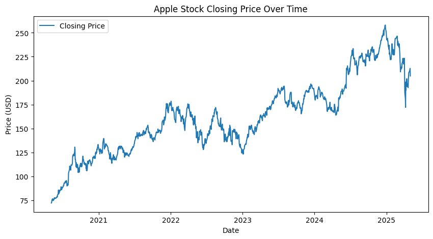
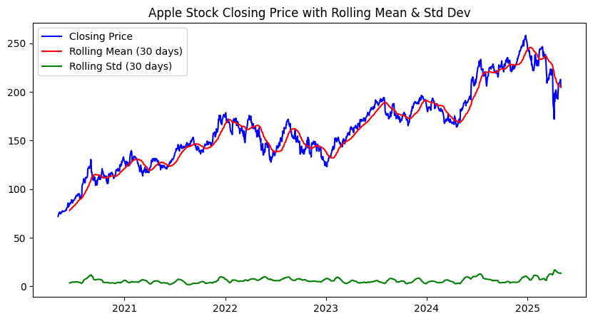
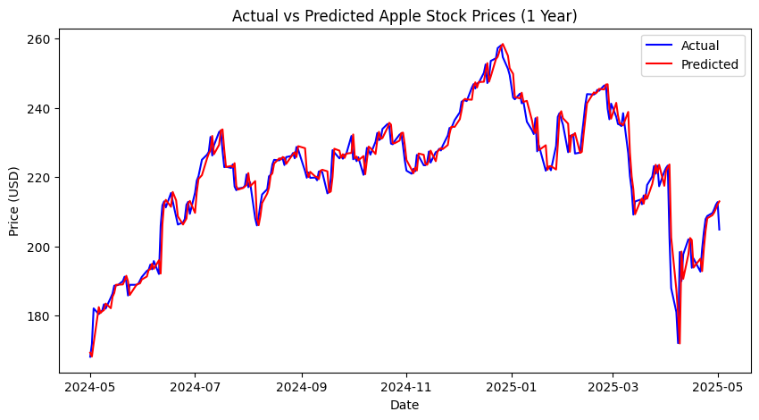
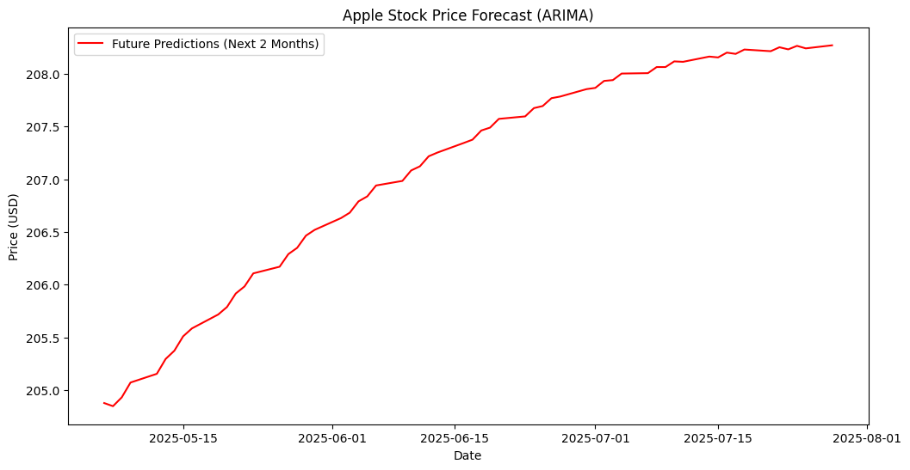

# ARIMA Stock Price Forecasting: Apple Inc. (AAPL)

---

## Table of Contents
1. [Project Scope](#project-scope)  
2. [Project Objectives](#project-objectives)  
3. [Expected Outcome](#expected-outcome)  
4. [Document Purpose](#document-purpose)  
5. [Use Case](#use-case)  
6. [Data Source](#data-source)  
7. [Data Cleaning and Processing](#data-cleaning-and-processing)  
8. [Data Analysis](#data-analysis)  
9. [Data Visualization](#data-visualization)  
10. [Recommendation](#recommendation)  
11. [Conclusion and Future](#conclusion-and-future)  
12. [Link](#link)  

---

## Project Scope
The project focuses on predicting **Apple Inc. (AAPL)** stock prices using the **ARIMA (AutoRegressive Integrated Moving Average)** model. It involves time series analysis, model evaluation, and forecasting.

---

## Project Objectives
- Extract and analyze Apple stock data from `yfinance`.  
- Apply ARIMA modeling for short-term forecasting.  
- Evaluate predictions with statistical metrics.  
- Provide insights into price trends for decision-making.  

---

## Expected Outcome
- A trained ARIMA model capable of forecasting Apple stock prices.  
- Predictions of Apple stock prices for the next few months.  
- Evaluation metrics (RMSE, MAE) to measure performance and also accuracy check using average error.  
- Visualization of historical data and ARIMA forecasts.  

---

## Document Purpose
This document provides the methodology, workflow, and results of using ARIMA to forecast Apple stock prices. It highlights key findings and recommendations for market analysis.

---

## Use Case
- **Investors**: Understand potential stock price movements.  
- **Traders**: Gain additional insights into price behavior.  
- **Data Scientists**: Reference workflow for time series forecasting projects.  

---

## Data Source
- Extracted from **Yahoo Finance** using the Python library **`yfinance`**.  
- Timeframe: 2020-05-05 to 2025-05-05  
- Features extracted:
  - `Date`  
  - `Open`  
  - `High`  
  - `Low`  
  - `Close`  
  - `Adj Close`  
  - `Volume`  

---

## Data Cleaning and Processing
- Extracted using yfinace using `yf.Ticker("AAPL")`.  
- Checked for missing values.  
- Explored the dataset, summary statistics and visualization.  
- Stationarity Check.  

---

## Data Analysis
This analysis was performed using **VS Code**, leveraging libraries such as **pandas**, **seaborn**, **matplotlib**, and **statsmodels**.

### Key Questions Explored:
- Is the stock price time series stationary?  
- What ARIMA parameters (`p`, `d`, `q`) provide the best fit?  
- How accurate is ARIMA at predicting test data?  
- What does 2-3 months of forecast for Apple stock prices looklike?  

---

## Data Visualization
- 
**Apple Closing Prices**

- 
   **Apple Closing Price vs Mean & Std Dev**

- 
**Actual vs Predicted**

-  
**Future Forecast**

---

## Recommendation
- ARIMA is effective for **short-term trend forecasting**.  
- For improved accuracy on complex patterns, hybrid models like **Prophet** or **LSTMs** should be tested.  
- Combining ARIMA with market sentiment and exogenous variables can improve predictions.  

---

## Conclusion and Future
- ARIMA successfully captured the overall Apple stock price trend.  
- Predictions indicated stable movements in the short term.  
- Future improvements:  
  - Automating ARIMA parameter selection.  
  - Benchmarking against deep learning models (e.g., LSTM, GRU).  
  - Incorporating external market features for richer forecasting.  

---

## Link
- GitHub Repository: [Insert Your Repo Link Here](#)